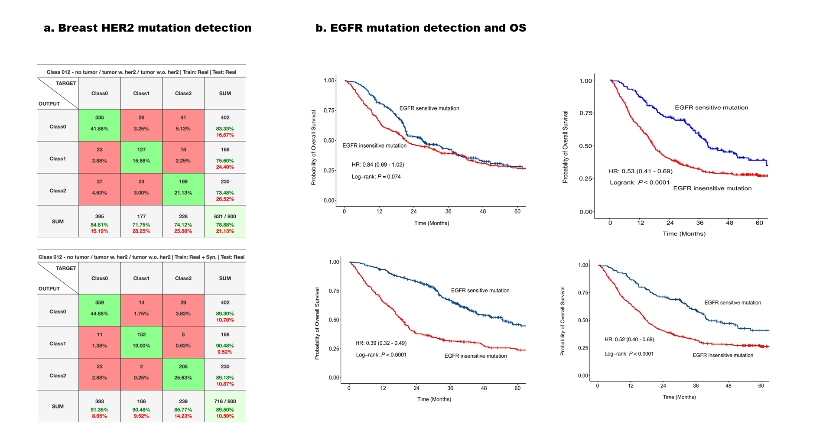
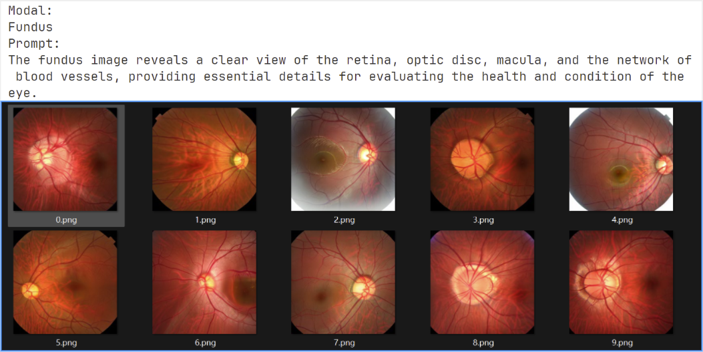
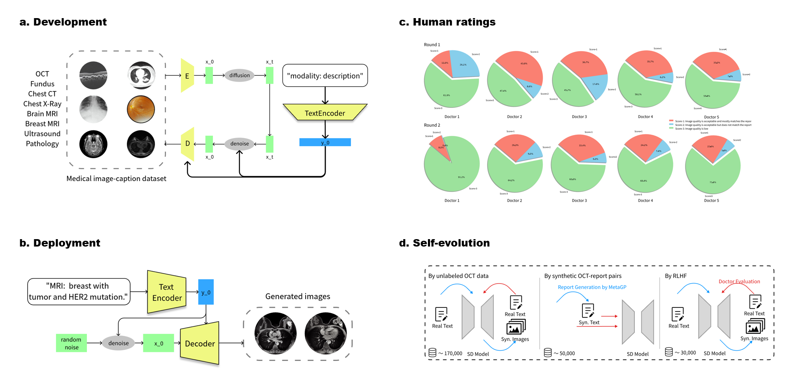

# Our Name

## Introduction

Our study addresses the critical need for high-quality medical imaging datasets by introducing the Medical Image-text geNeratIve Model (MINIM), a novel generative model designed to produce synthetic images across various medical modalities and organs. The timeliness of this research is underscored by the growing demand for robust diagnostic tools in the medical field.

We have developed MINIM to incorporate a diverse range of medical images paired with textual descriptions. This includes OCT for ophthalmology, Fundus for retinal analysis, chest X-ray for respiratory conditions, chest CT for detailed lung imaging, and brain MRI for neurological assessments. MINIM has been demonstrated to generate high-quality synthetic images based on text prompts for each organ and modality, showcasing its adaptability and potential for life-long learning. The successful integration of a new private breast MRI dataset further validates MINIM's capacity to improve with increased training data from new domains.

## Clinical Applications

- **Diagnostic Assistance**: The generated images, once vetted by the filtering model, are used to assist in diagnostic processes, providing additional insights to medical professionals.
- **Data Augmentation**: High-quality synthetic images also serve as valuable data augmentation for training other diagnostic models, improving their generalizability and performance.



## Use Our Model

To use our model on your own computer, make sure your computer has at least one GPU that can be detected by CUDA first. Download [this folder](https://pan.baidu.com/s/1cxeonEof1oJRMF_Y-rF0UA?pwd=1234) and run `run_minim.exe` in it. You should input the modal and prompt to tell the model what kind of image you want. Besides, you should also input how many images you need and specify the output directory.




## Framework

- **Diffusion Model**: We started with a pretrained diffusion model [stable-diffusion-v1-4](https://github.com/CompVis/stable-diffusion/blob/main/Stable_Diffusion_v1_Model_Card.md) and fine-tune it on our dataset containing multi-modal medical images.
- **Reinforcement Learning**: After training, our model generates a variety of medical images across different modalities.These images are then presented to medical professionals who assess the congruence between the generated images and their corresponding prompts. Utilizing the scoring data from the physicians, we train a filtering model that learns to distinguish between high-quality and low-quality image generations.



## Key Contributions
- **MINIM Development**: Introduction of a novel generative model that is capable of producing synthetic images for multiple medical modalities and organs.
- **Generalizability and Adaptability**: Demonstration of MINIM's ability to adapt and improve with new training data, highlighting its potential for continuous learning.
- **Clinical Utility**: Evidence of MINIM's significant impact on the detection of critical genetic mutations, underscoring its clinical relevance and potential to transform diagnostic practices.

## Installation

Our framework is mainly based on [diffusers](https://github.com/huggingface/diffusers.git),
Follow these steps to install and run the project:

1. Clone the repository and navigate to the project directory

    ```bash
    git clone https://github.com/WithStomach/MINIM.git
    cd MINIM
    ```

2. Install diffusers

    ```bash
    pip install git+https://github.com/huggingface/diffusers.git
    pip install -U -r requirements.txt
    ```

3. Initialize an Accelerate environment

    ```bash
    accelerate config
    ```

For more detailed installation instructions, refer to <https://huggingface.co/docs/diffusers/v0.13.0/en/training/text2image>

## Data Format

The input data should be a single csv file containing three columns: `path`, `Text` and `modality`, where `path` represents the path to an image and `Text` is the description to it.

```csv
path, Text, modality
image/1.jpg, breast with tumor, MRI
image/2.jpg, chest without tumor, CT
```

## Usage

### Train

To train the model, follow these steps:

1. Ensure you have the correctly formatted data and a pretrained diffusion model.

2. Navigate to the following directory

    ```bash
    cd examples/text_to_image
    ```

3. Edit the first few lines of `train.sh`

    ```bash
    export MODEL_NAME="path/to/pretrained_model"
    export DATASET_NAME="path/to/data.csv"
    ```

4. Run the training script

    ```bash
    bash train.sh
    ```

This will execute the `train.sh` script, which contains all the necessary commands to start the training process. And the checkpoints will be saved in `./checkpoint` by default.

### Deployment

For the sake of using the model to generate images according to given prompt, you just need to run:

```bash
python generate.py --model_path=path/to/pretrained_model --checkpoint=path/to/checkpoint/unet --prompt=prompt --output_dir=output/
```
