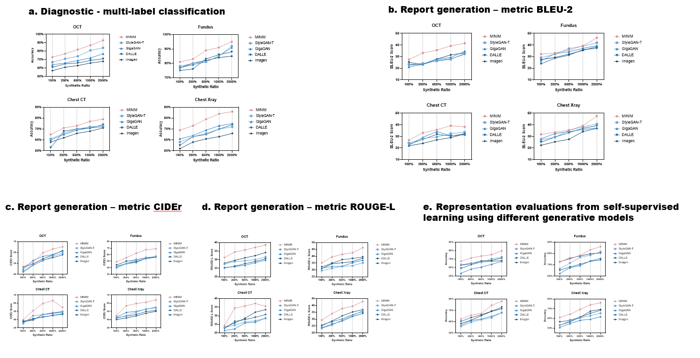

# <font color=Aqua> MINIM </font>

[Intro](#introduction)
[Download](#use-of-minim)
[Methods](#methods)
[Contributions](#contributions)

## Introduction

Our study addresses the critical need for high-quality medical imaging datasets by introducing the Medical Image-text geNeratIve Model (MINIM), a novel generative model designed to produce synthetic images across various medical modalities and organs. The timeliness of this research is underscored by the growing demand for robust diagnostic tools in the medical field.

We have developed MINIM to incorporate a diverse range of medical images paired with textual descriptions. This includes OCT for ophthalmology, Fundus for retinal analysis, chest X-ray for respiratory conditions, chest CT for detailed lung imaging, and brain MRI for neurological assessments. MINIM has been demonstrated to generate high-quality synthetic images based on text prompts for each organ and modality, showcasing its adaptability and potential for life-long learning. The successful integration of a new private breast MRI dataset further validates MINIM's capacity to improve with increased training data from new domains.

## Use of MINIM

To use our model on your own computer, make sure your computer has at least one GPU that can be detected by CUDA first. Download [this folder](https://pan.baidu.com/s/1cxeonEof1oJRMF_Y-rF0UA?pwd=1234) and run `run_minim.exe` in it. You should input the modal and prompt to tell the model what kind of image you want. Besides, you should also input how many images you need and specify the output directory.


## Methods

- **Framework**
MINIM was trained on paired medical images and descriptions across different medical image modalities. To generate specific modality images accurately, the model concatenates modality information with description information to form the text input. The BERT tokenizer encodes these inputs separately, and random Gaussian noise is progressively applied to the input images during training. The noise follows a linear scheduler, and MINIM learns to reverse the diffusion process using a U-Net architecture with cross-attention mechanisms that incorporate both modality and description information.


- **Ablation Study**
We compared MINIM with state-of-the-art text-to-image generative models, including Imagen7, DALLE8, GigaGAN6, and StyleGAN-T5. These models were fine-tuned on our dataset using hyperparameters specified in their original papers. An ablation study was conducted to determine the optimal hyperparameters for MINIM. The synthetic image quality was evaluated using the average of three metrics: FID, IS, and MS-SSIM. As training steps increased, synthetic image quality improved significantly, with FID decreasing to 57.91, MS-SSIM improving to 0.18, and IS increasing to 5.89 at 20,000 training steps. The best performance was achieved with the full MINIM model initialized with pre-trained weights and trained at a resolution of 512x512 pixels for 20,000 steps.


- **Reinforcement Learning**
We developed a two-stage reinforcement learning (RL) framework with human feedback to iteratively train an RL agent using synthetic data (Supplementary Figure 7). This framework leverages synthetic images and radiologist ratings to generate high-quality data, particularly useful when real-world data is scarce, expensive, or risky to obtain.


- **Downstream implementation**
We employed synthetic OCT images to enhance multi-classification and report generation models. Using the Swin-Transformer model, we incorporated 100-500 synthetic images per diagnostic category to improve classification accuracy, F1 score, and AUC. For report generation, a CLIP+GPT2-based model was trained with synthetic images, evaluated using BLEU, CIDEr, and ROUGE-L metrics. Additionally, we demonstrated the effectiveness of synthetic data in self-supervised learning with DenseNet-121, achieving comparable performance to models trained on real data.


## Contributions

- **MINIM Development**: Introduction of a novel generative model that is capable of producing synthetic images for multiple medical modalities and organs.
- **Generalizability and Adaptability**: Demonstration of MINIM's ability to adapt and improve with new training data, highlighting its potential for continuous learning.
- **Clinical Utility**: Evidence of MINIM's significant impact on the detection of critical genetic mutations, underscoring its clinical relevance and potential to transform diagnostic practices.

## Installation

If you just want to use our model to generate medical images, we strongly recommend you download the [exe](https://pan.baidu.com/s/1cxeonEof1oJRMF_Y-rF0UA?pwd=1234) rather than install the repo.

If you want to use our code to train your own model, follow these steps to install and run the project:

1. Clone the repository and navigate to the project directory

    ```bash
    git clone https://github.com/WithStomach/MINIM.git
    cd MINIM
    ```

2. Install diffusers

    ```bash
    pip install git+https://github.com/huggingface/diffusers.git
    pip install -U -r requirements.txt
    ```

3. Initialize an Accelerate environment

    ```bash
    accelerate config
    ```

## Data Format

The input data should be a single csv file containing three columns: `path`, `Text` and `modality`, where `path` represents the path to an image and `Text` is the description to it.

```csv
path, Text, modality
image/1.jpg, breast with tumor, MRI
image/2.jpg, chest without tumor, CT
```

## Train Your Own Model

### Train

To train the model, follow these steps:

1. Ensure you have the correctly formatted data and a pretrained diffusion model.

2. Edit the first few lines of `train.sh`

    ```bash
    export MODEL_NAME="path/to/pretrained_model"
    export DATASET_NAME="path/to/data.csv"
    ```

3. Run the training script

    ```bash
    bash train.sh
    ```

This will execute the `train.sh` script, which contains all the necessary commands to start the training process. And the checkpoints will be saved in `./checkpoint` by default.

### Deployment

For the sake of using the model to generate images according to given prompt, you just need to run:

```bash
bash generate.sh
```

## Clinical Applications

- **Diagnostic Assistance**: The generated images, once vetted by the filtering model, are used to assist in diagnostic processes, providing additional insights to medical professionals.
- **Data Augmentation**: High-quality synthetic images also serve as valuable data augmentation for training other diagnostic models, improving their generalizability and performance.


